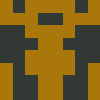

# Goavatar Identicon Generator in Go

This package provides a simple way to generate unique, symmetric identicons based on an input string (e.g., an email address or username). It uses an **MD5 hash** to create a deterministic pattern and color scheme, then mirrors the design for a visually appealing avatar.

## User Avatars

<p align="center">
  <kbd>
    <br/>
    <strong>QuantumNomad42</strong>
  </kbd>
  &nbsp;&nbsp;&nbsp;&nbsp;
  <kbd>
    <br/>
    <strong>EchoFrost7</strong>
  </kbd>
  &nbsp;&nbsp;&nbsp;&nbsp;
  <kbd>
    <br/>
    <strong>NebulaTide19</strong>
  </kbd>
  &nbsp;&nbsp;&nbsp;&nbsp;
  <kbd>
    <br/>
    <strong>ZephyrPulse88</strong>
  </kbd>
  &nbsp;&nbsp;&nbsp;&nbsp;
  <kbd>
    <br/>
    <strong>EmberNexus23</strong>
  </kbd>
</p>

## Installation

To use this package in your Go project, install it via:

```sh
go get github.com/MuhammadSaim/goavatar
```

Then, import it in your Go code:

```go
import "github.com/MuhammadSaim/goavatar"
```

## Usage

### **Basic Example**

```go
package main

import (
	"image/color"

	"github.com/MuhammadSaim/goavatar"
)

func main() {
    // empty slice
	imgSlice := make([]image.Image, 0)

	// Generate the first avatar with a custom width and height
	options1 := goavatar.Options{
		Width:  512, // Set custom image width (default is 256)
		Height: 512, // Set custom image height (default is 256)
	}
	iamge1 := goavatar.Make("QuantumNomad42", options1)
	// Generates a unique avatar based on "QuantumNomad42" and saves it as avatar_1.png

	// Generate the second avatar with a custom grid size
	options2 := goavatar.Options{
		Width:    512, // Set custom image width (default is 256)
		Height:   512, // Set custom image height (default is 256)
		GridSize: 10,  // Set custom grid size (default is 8), affects pattern complexity
	}
	image2 := goavatar.Make("EchoFrost7", options2)
	// Generates an avatar with a 10x10 grid for more detail and saves it as avatar_2.png

	// Generate the third avatar with a custom background color
	options3 := goavatar.Options{
		Width:   512,                           // Set custom image width (default is 256)
		Height:  512,                           // Set custom image height (default is 256)
		BgColor: color.RGBA{170, 120, 10, 255}, // Change background color (default is light gray)
	}
	image3 := goavatar.Make("NebulaTide19", options3)
	// Generates an avatar with a brownish background color and saves it as avatar_3.png

	// Generate the fourth avatar with a custom foreground and background color
	options4 := goavatar.Options{
		Width:   512,                            // Set custom image width (default is 256)
		Height:  512,                            // Set custom image height (default is 256)
		BgColor: color.RGBA{170, 120, 10, 255},  // Change background color (default is light gray)
		FgColor: color.RGBA{255, 255, 255, 255}, // Change foreground color (default is extracted from hash)
	}
	image4 := goavatar.Make("ZephyrPulse88", options4)
	// Generates an avatar with a brownish background and white foreground, saving it as avatar_4.png

	// Generate an avatar using default settings
	image5 := goavatar.Make("EmberNexus23", goavatar.Options{})
	// Uses default width (256), height (256), grid size (8), and colors
	// Saves the generated avatar as avatar_5.png

    	// append all the images into the list
	imgSlice = append(imgSlice, image1, image2, image3, image4, image5)

	// loop through the image slice and save the images
	for i, img := range imgSlice {

		filename := fmt.Sprintf("../arts/avatar_%d.png", i+1)

		// Create the file
		file, err := os.Create(filename)
		if err != nil {
			fmt.Println("Error creating file:", err)
			continue
		}
		defer file.Close()

		// Encode image as PNG and save
		err = png.Encode(file, img)
		if err != nil {
			fmt.Println("Error saving image:", err)
		} else {
			fmt.Println("Saved: ", filename)
		}
}

```

This will generate a unique identicons for the input string and save in the `arts` directory.

## Package Documentation

### **Generate Identicon**

```go
func Make(input, goavatar.Options{}) image.Image
```

-   `input`: A string used to generate a unique identicon (e.g., email, username).
-   `goavatar.Options{}`: Options to override the default values.
-   `image.Image`: function returns an `image.Image`, allowing the caller to handle image processing, encoding, and storage as needed.

## License

This project is open-source under the MIT License.

## Contributing

Contributions are welcome! Feel free to open a pull request or create an issue.
