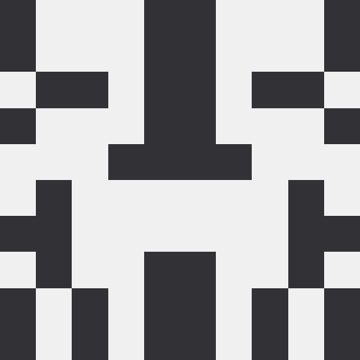
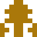

# Goavatar Identicon Generator in Go

This package provides a simple way to generate unique, symmetric identicons based on an input string (e.g., an email address or username). It uses an **MD5 hash** to create a deterministic pattern and color scheme, then mirrors the design for a visually appealing avatar.

## Example User Avatars

<p align="center">
  <kbd>
    <br/>
    <strong>QuantumNomad42</strong>
  </kbd>
  &nbsp;&nbsp;&nbsp;&nbsp;
  <kbd>
    <br/>
    <strong>EchoFrost7</strong>
  </kbd>
  &nbsp;&nbsp;&nbsp;&nbsp;
  <kbd>
    <br/>
    <strong>NebulaTide19</strong>
  </kbd>
  &nbsp;&nbsp;&nbsp;&nbsp;
  <kbd>
    <br/>
    <strong>ZephyrPulse88</strong>
  </kbd>
  &nbsp;&nbsp;&nbsp;&nbsp;
  <kbd>
    <br/>
    <strong>EmberNexus23</strong>
  </kbd>
</p>

## Examples with Custom-Shaped Pixels

<p align="center">
  <kbd>
    <br/>
    <strong>Shaped fg pixels</strong>
  </kbd>
  &nbsp;&nbsp;&nbsp;&nbsp;
  <kbd>
    <br/>
    <strong>Shaped fg pixels w/transparency</strong>
  </kbd>
  &nbsp;&nbsp;&nbsp;&nbsp;
  <kbd>
    <br/>
    <strong>Shaped fg &amp; bg pixels</strong>
  </kbd>
  &nbsp;&nbsp;&nbsp;&nbsp;
  <kbd>
    <br/>
    <strong>Shaped fg &amp; bg pixels, w/transparency</strong>
  </kbd>
</p>

## Installation

To use this package in your Go project, install it via:

```sh
go get github.com/MuhammadSaim/goavatar
```

Then, import it in your Go code:

```go
import "github.com/MuhammadSaim/goavatar"
```

## Examples

See the [example folder](./example) for a program that creates the identicons found in the [arts directory](./arts).

## Package Documentation

### Generate Identicon

```go
func Make(input, ...optFunc) image.Image
```

- `input`: A string used to generate a unique identicon (e.g., email, username).
- `...optFunc`: Functional options to override the default values.
- `image.Image`: Function returns an `image.Image`, allowing the caller to handle image processing, encoding, and storage as needed.

### Functional Options

```go
// WithSize sets the size of the avatar.
// It is always square and has a minimum size of 64x64
func WithSize(s int) optFunc

// WithGridSize sets the grid size of the avatar.
func WithGridSize(g int) optFunc

// WithBgColor sets the background color of the avatar.
func WithBgColor(r, g, b, a uint8) optFunc

// WithFgColor sets the foreground color of the avatar.
func WithFgColor(r, g, b, a uint8) optFunc

// WithFgShape sets the shape of the foreground pixels.
func WithFgShape(s [][]int) optFunc

// WithBgShape sets the shape of the background pixels.
func WithBgShape(s [][]int) optFunc

// WithTransparency sets the option to have the background show
// through any negative space in shaped foreground pixels.
func WithTransparency() optFunc
```

## License

This project is open-source under the MIT License.

## Contributing

Contributions are welcome! Feel free to open a pull request or create an issue.
